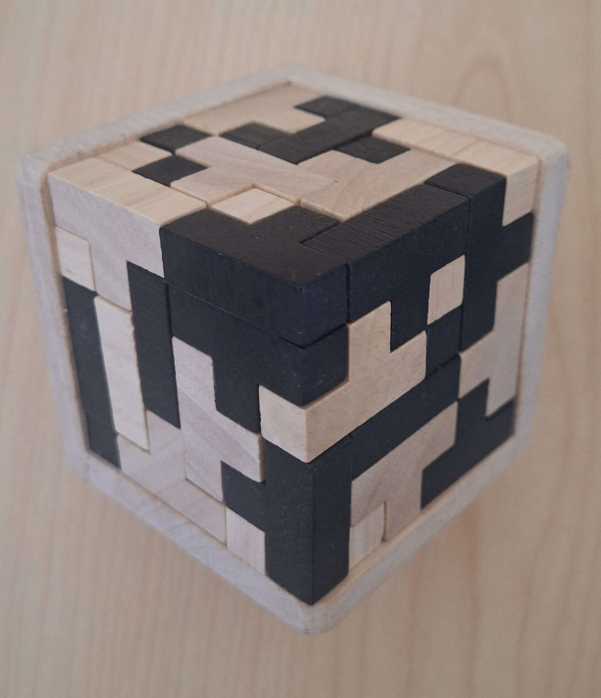

# Dancing Links in Python

A Python script implementing [Knuth's Dancing Links algorithm](https://arxiv.org/abs/cs/0011047), and some helpers to support applying it to 2D and 3D polyomino/polycube tiling problems.

The motivation was to solve a physical 3D puzzle left alone for months.

54 T-tetrominoes can fit into a 6 x 6 x 6 cube, and once they came apart I couldn't figure out how to put them back together.

By stating it as an exact cover problem and implementing Dancing Links to solve it, the 3D puzzle can finally be reassembled.

## To run

`python main.py`, or `uv run main.py`.

The `dancing_links_nodes.py` and `dancing_links_root.py` are untyped, so will fail the strict mypy checking.
